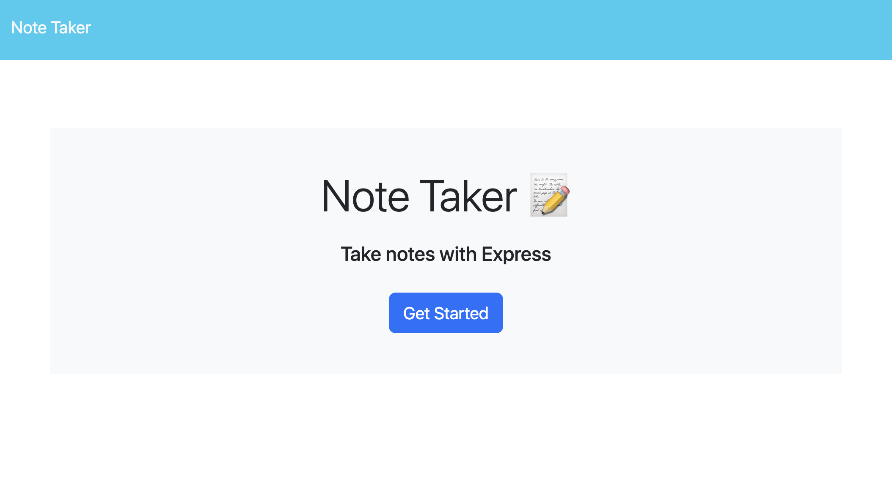
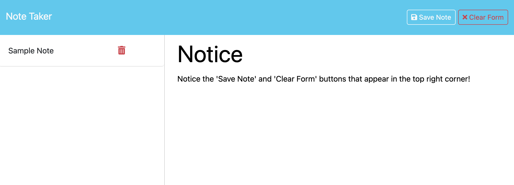
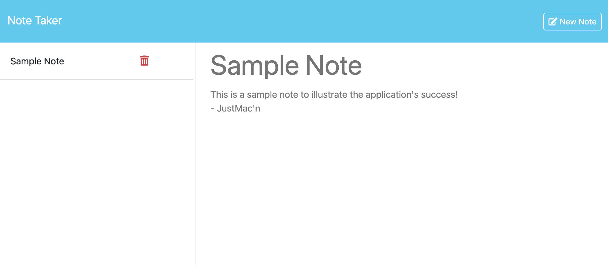

# Note-Taker 
  

## Description

Note Taker is a web application that will dynamically create and store a note on the browser using backend logic with Node.js and Express.js. This app features a landing page and a notes page, with interatice buttons on the notes page to save, view, delete, and create new notes. 

It utilizies express.js middleware to hide the api endpoints and routes that GET and POST the notes as JSON data. A DELETE request method was also used to allow users to removee their stored notes from the JSON file.

## Table of Contents

- [Installation](#installation)

- [Usage](#usage)

- [Links](#links)

- [Questions](#questions)

## Installation

This application uses the following node.js dependencies:
- [express.js](https://expressjs.com) 

- [uuid](https://www.npmjs.com/package/uuid)

## Usage

This web application can be used to generate quick and easy notes in the browser. Individual notes can be saved, viewed at a later date, and deleted upon request.

### Mock-up

Note-Taker app - Landing page

--

Note-Taker app - Create new note

--

Note-Taker app - View saved note

## Links
Find the project repository and deployed application below:

- [Note Taker Application](https://note-taker-ctw9.onrender.com/)

- [Project Repository](https://github.com/justmacn/Note-Taker)

## Questions

For any additional questions you can reach me at:

- Github: [Justmacn](https://github.com/Justmacn)

- Email: 172618812+justmacn@users.noreply.github.com